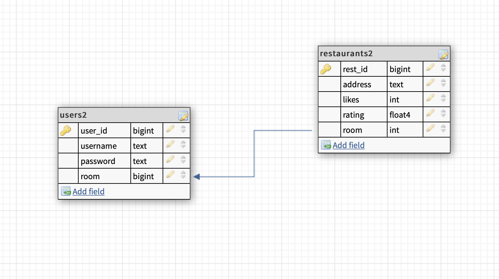
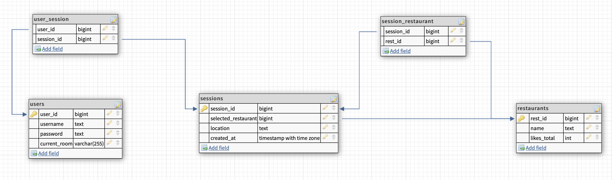

# Rinder Data Model

## Database Type

PostgreSQL


## Database Schema (lite)
This image is outdated.  Check Tables sections below for latest schema.



### Tables

#### users

```sql
CREATE TABLE "users" (
  user_id SERIAL PRIMARY KEY,
  name varchar(255),
  username varchar(255),
  password varchar(255),
  room varchar(255)
);
```
```sql
DROP TABLE IF EXISTS "users";
```
```sql
INSERT INTO "users" (name,username,password,room) 
VALUES 
('ted','ted','password','8KnM'),
('emma','emma','password','8KnM'),
('may','may','password','AwSz'),
('faraz','faraz','password'),
('richard','richard','password')
;
```

#### restaurants
```sql
create table restaurants (
	rest_id SERIAL PRIMARY KEY,
	name VARCHAR(50),
	rating NUMERIC,
	address VARCHAR(50),
	photo VARCHAR(255),
	likes INT,
	room VARCHAR(50)
);
```
```sql
DROP TABLE IF EXISTS "restaurants";
```
```sql
insert into restaurants (name, rating, address, photo, likes, room) 
values 
('Mymm', 0.2, '0 Mallard Crossing', 'http://dummyimage.com/233x100.png/cc0000/ffffff', null, null),
('Twitterwire', 4.7, '46 Sauthoff Pass', 'http://dummyimage.com/230x100.png/dddddd/000000', null, null),
('Dynabox', 1.2, '73390 Westend Street', 'http://dummyimage.com/188x100.png/dddddd/000000', null, '12C4'),
('Oyonder', 3.3, '9 Green Parkway', 'http://dummyimage.com/222x100.png/cc0000/ffffff', null, null),
('Jazzy', 0.1, '28 Warbler Pass', 'http://dummyimage.com/133x100.png/dddddd/000000', null, null),
('Dabfeed', 2.5, '121 International Point', 'http://dummyimage.com/128x100.png/cc0000/ffffff', null, '12C4'),
('Realpoint', 0.4, '8 Bluejay Alley', 'http://dummyimage.com/207x100.png/5fa2dd/ffffff', null, null),
('Quatz', 1.3, '95939 Bartelt Trail', 'http://dummyimage.com/106x100.png/5fa2dd/ffffff', null, null),
('Yadel', 2.4, '02 Maywood Crossing', 'http://dummyimage.com/153x100.png/cc0000/ffffff', null, null),
('Photospace', 2.2, '64052 Graedel Park', 'http://dummyimage.com/210x100.png/cc0000/ffffff', null, '12C4')
;
```

## Database Schema (stretch)


